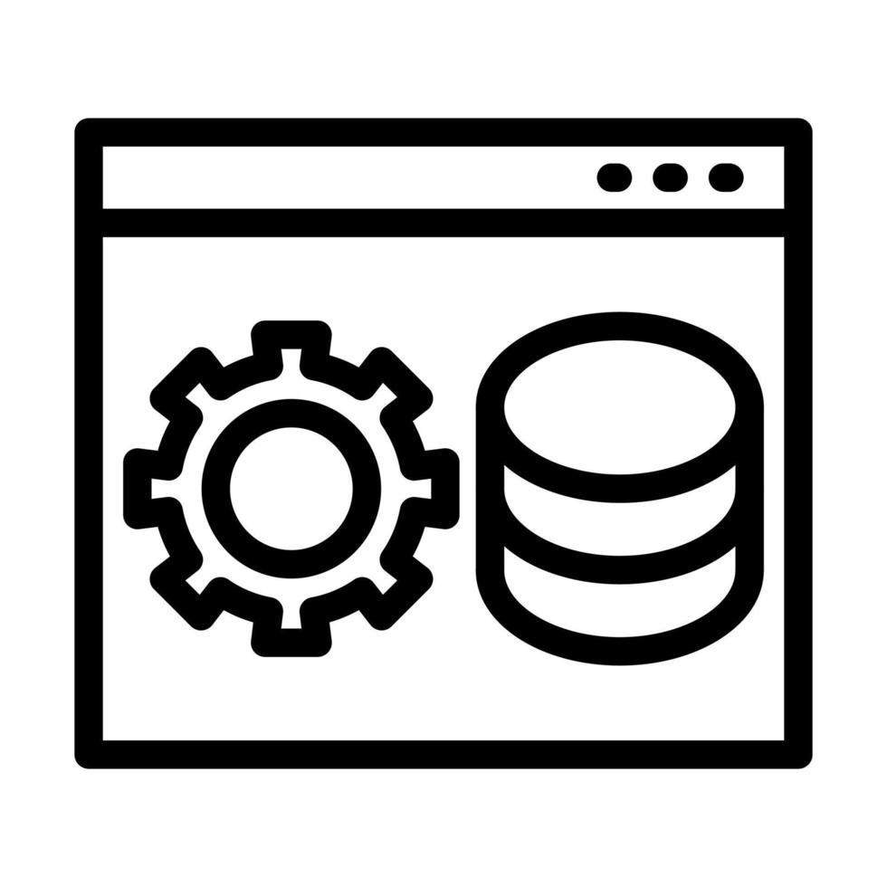

[![Commits][commits-shield]][commits-url]
[![Programs][programs-shield]][programs-url]
[![All Programs Pass Tests][appt-shield]][appt-url]
[![All Applications Contains Documentations][aacd-shield]][aacd-url]
[![Actively Updating][au-shield]][au-url]

<!-- PROJECT LOGO -->
<table border="0" cellspacing="0" cellpadding="0">
  <tr>
    <td style="vertical-align: middle;">
      
    </td>
    <td style="vertical-align: middle; padding-left: 15px;">
      <h3 style="margin: 0;">Backend Project Family</h3>
    </td>
  </tr>
</table>

  This project family encompasses constructed servers and APIs, as well as other practical back-end applications. Each repository represents an independent project, including a README.md file explaining its main file structures and functionalities.

[![JavaScript][js-shield]][js-url]
[![Node.js][nodejs-shield]][nodejs-url]

<!-- TABLE OF CONTENTS -->

  
Table of Contents

  <ol>
    <li><a href="#about-the-project">About The Project</a></li>
    <li><a href="#contact">Contact</a></li>
    <li><a href="#folder-structures-and-file-contents">Folder Structures and File Contents</a></li>
  </ol>

<!-- ABOUT THE PROJECT -->
<h2 id="about-the-project">
  
  About The Project
</h2>

This project includes backend applications in the following fields:

- [x] Servers.
- [x] Application interfaces (APIs).
- [x] Dependent software artifacts

TODO

  

<!-- CONTACT -->
<h2 id="contact">
  
  Contact
</h2>

**Personal Email Address** - david1147062956@gmail.com

Research Email Address - dai.jingze@icloud.com

Personal Portfolio - [https://daijingz.github.io/Jingze_Portfolio/index.html](https://daijingz.github.io/Jingze_Portfolio/index.html)

  

<h2 id="folder-structures-and-file-contents">
   
  Folder Structures and File Contents
</h2>

**{Y}**
  - Backend project with title Y (including all files) 

README.md
  - This file

  

[commits-shield]: https://img.shields.io/badge/Commits-32-blue
[commits-url]: https://github.com/daijingz/Backend_Applications/commits/main/
[programs-shield]: https://img.shields.io/badge/Sub_Projects-2-green
[programs-url]: https://github.com/daijingz/Backend_Applications/
[appt-shield]: https://img.shields.io/badge/All_Programs_Verified_By_Tests-purple
[appt-url]: https://github.com/daijingz/Backend_Applications
[aacd-shield]: https://img.shields.io/badge/All_Applications_Contain_Documentations-orange
[aacd-url]: https://github.com/daijingz/Backend_Applications
[au-shield]: https://img.shields.io/badge/Actively_Updating-darkred
[au-url]: https://www.linkedin.com/in/jingze-dai/

[js-shield]: https://img.shields.io/badge/JavaScript-lightyellow
[js-url]: https://devdocs.io/javascript/
[nodejs-shield]: https://img.shields.io/badge/Node.js-darkgreen
[nodejs-url]: https://nodejs.org/docs/latest/api/
